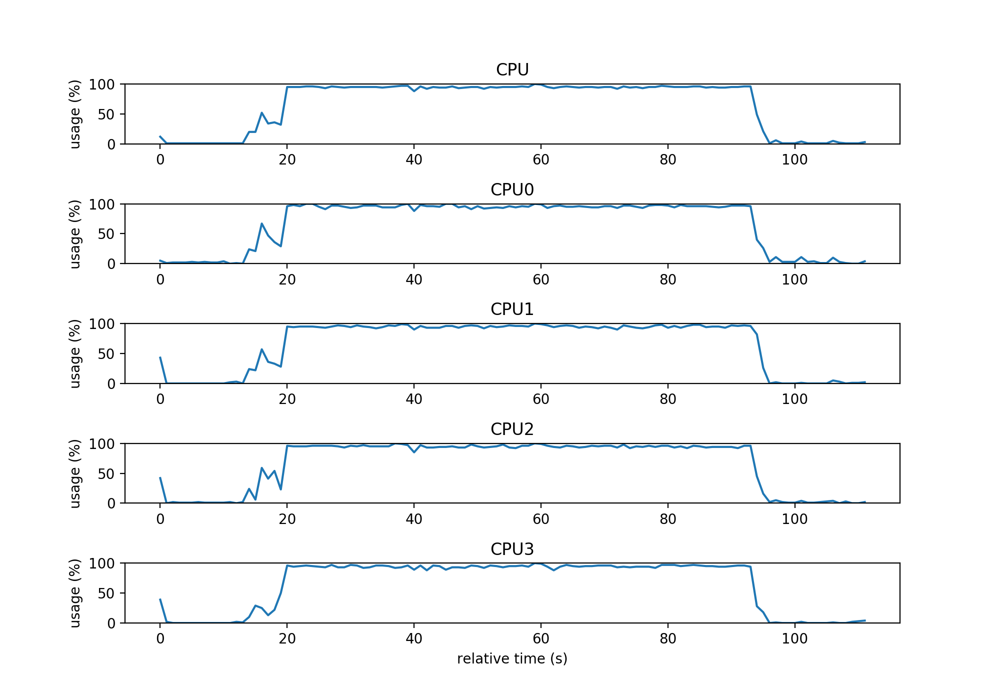

# Torch Android Example with OpenMP

This repo is built on top of [paramsen/torch-android-studio-template](https://github.com/paramsen/torch-android-studio-template) which is a modern working sample of `torch-android`.
More information can be found on: [paramsen.github.io](https://paramsen.github.io/building-torch-android-01/)


## Setup

#### Install Torch 7 on ubuntu

```bash
$ git clone https://github.com/torch/distro.git ~/torch --recursive
$ cd ~/torch; bash install-deps;
$ ./install.sh

# On Linux with bash
$ source ~/.bashrc
# On Linux with zsh
$ source ~/.zshrc
# On OSX or in Linux with none of the above.
$ source ~/.profile
```

Run torch with the command th to make sure torch is installed
```
$ th

 ______             __   |  Torch7                                   
/_  __/__  ________/ /   |  Scientific computing for Lua.         
 / / / _ \/ __/ __/ _ \  |                                           
/_/  \___/_/  \__/_//_/  |  https://github.com/torch   
                         |  http://torch.ch            

th> torch.Tensor{1,2,3}
1
2
3
[torch.DoubleTensor of dimension 3]     
```

#### Build `torch-android` library
- clone the library
```
$ git clone https://github.com/soumith/torch-android.git
$ cd torch-android
```
- Download submodule
```
$ git submodule update --init --recursive
```
If you fail to download `external/libpng`, please clone it manually
```
$ cd ..
$ wget https://github.com/borisfom/platform_external_libpng/archive/2964a877aeeb02a66eeba084ceb1dfa3c6836f1b.zip
$ unzip 2964a877aeeb02a66eeba084ceb1dfa3c6836f1b.zip
$ cp -r ./platform_external_libpng-2964a877aeeb02a66eeba084ceb1dfa3c6836f1b/* ./torch-android/external/libpng/
```
- Download NDK v13b and move to your home directory
    https://dl.google.com/android/repository/android-ndk-r13b-linux-x86_64.zip
- Add ndk-build to your $PATH
```bash
$ export PATH="$HOME/android-ndk-r13b:$PATH"
```
- Modify `ARCH` and `WITH_CUDA` variables in `build.sh` at line 8, line 13
    ```
    Nexus 6:
    ARCH="v7n"   WITH_CUDA="OFF"
    ```
- Run the script
```
$ ./build.sh
```
The libraries can be found in `torch-android/install`

## Run Example Application

- Copy the binaries to `./app/native-libs` and the built lua lib to `./app/src/main/assets/lua`.

- Build the app with `SDK 25` and `CMake`, `NDK` installed
    If using Android Studio, install them at `Tool > Android > SDK Manager`
```
$ ./gradlew build
```
- Install apk
```
$ adb install app/build/outputs/apk/app-debug.apk
```

## Monitor CPU Usage

- Get each cpu usage statistic, run `cpu.sh`
```
$ ./cpu.sh
```

- Visualize cpu usage, run `cpu_live_graph.py` (need python installed)
```
$ python cpu_live_graph.py
```



## OpenMP

- You can find openmp test in `./app/src/main/native/OMPTest.cpp`

- THNN Functions that support OpenMP
```
HardTanh.c
LogSoftMax.c
LookupTable.c
PReLU.c
SoftMax.c
SparseLinear.c
SpatialAdaptiveMaxPooling.c
SpatialAveragePooling.c
SpatialClassNLLCriterion.c
SpatialConvolutionLocal.c
SpatialConvolutionMap.c
SpatialConvolutionMM.c
SpatialDilatedMaxPooling.c
SpatialFractionalMaxPooling.c
SpatialFullConvolutionMap.c
SpatialMaxUnpooling.c
SpatialReflectionPadding.c
SpatialReplicationPadding.c
SpatialSubSampling.c
Sqrt.c
Square.c
Tanh.c
TemporalMaxPooling.c
unfold.c
VolumetricAveragePooling.c
VolumetricConvolutionMM.c
VolumetricDilatedMaxPooling.c
VolumetricMaxUnpooling.c
VolumetricReplicationPadding.c
```
